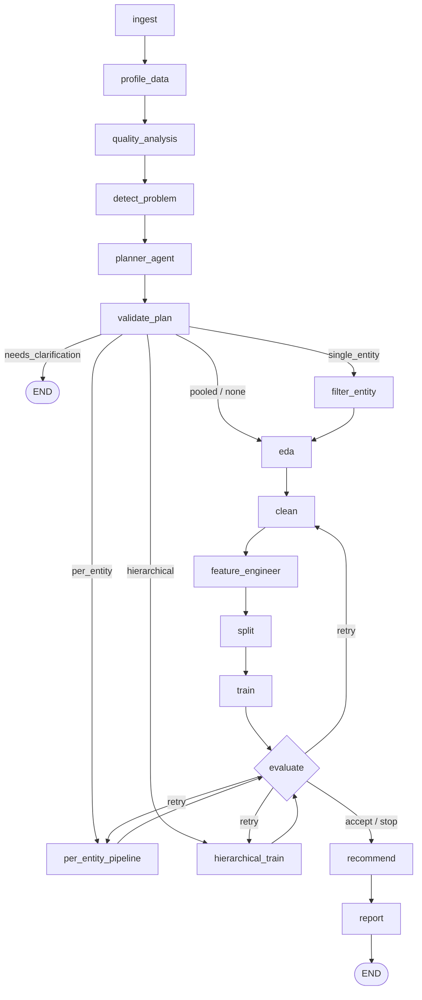

# Agentic AI ML Pipeline

Implementation of `Agentic_ML_Pipeline_Implementation_Plan.txt` (Phases 1-8).
Given a dataset + business problem description, it plans, cleans, engineers
features, trains models via AutoGluon, evaluates, and produces a
recommendation report. The LLM only ever sees column names/dtypes/stats/
metrics/logs - never raw rows (see Section 1 of the plan and
`tests/test_llm_safety.py`).

## Setup

```
py -3.11 -m venv .venv
.venv\Scripts\pip install -r requirements.txt
copy .env.example .env   # then fill in GROQ_API_KEY
```

AutoGluon requires Python <=3.11; this project targets 3.11 for that reason.

## Run

CLI:
```
.venv\Scripts\python main.py --data sample_data\churn_classification.csv ^
    --description "Predict which customers will churn next month" ^
    --sensitive-columns customer_name
```

Web UI (FastAPI backend + React frontend):
```
.venv\Scripts\uvicorn api.main:app --reload --port 8000
```
```
cd frontend
npm install   # first time only
npm run dev
```
Then open http://localhost:5173. The Vite dev server proxies `/api/*` to the
FastAPI backend on port 8000. Uploaded files are stored locally under
`uploads/` (gitignored) - this is a local single-user tool, not a hosted
multi-tenant service (see Section 9.6 of the plan).

Sample datasets (synthetic, generated by `scripts_generate_sample_data.py`)
live in `sample_data/`: classification (`churn_classification.csv`),
regression (`house_price_regression.csv`), and three forecasting variants -
simple/no-seasonality (`simple_timeseries.csv`), seasonal
(`sales_forecasting.csv`), and multi-entity (`multi_entity_timeseries.csv`).

## Orchestration (pipeline graph)

The pipeline is a LangGraph `StateGraph` (`orchestration/graph.py`, built by
`build_graph()` and driven by `run_pipeline()`) over a single `PipelineState`
dict threaded node-to-node - the DataFrame itself lives only in this
process's local state and is never serialized to an LLM; only
`schema_summary`/`eda_summary`/`metrics` are.



**Deterministic Data Intelligence (no LLM call), always run first:**
```
ingest -> profile_data -> quality_analysis -> detect_problem
```
`profile_data`/`quality_analysis`/`detect_problem` are pandas-only
(`tools/profiling.py`, `tools/problem_detection.py`) and produce the
`DatasetProfile`, `TargetAnalysis`, `DataQualityReport`, and
`ProblemDefinition` the Planner reasons over, instead of the Planner
inferring everything itself from a thin schema summary.

**Planning:**
```
planner_agent -> validate_plan
```
`planner_agent` (`agents/planner.py`) is the only LLM call before training -
it produces an `ExperimentPlan` (a shortlist of candidate approaches, not the
final model choice) and decides the run's `scope_strategy`. `validate_plan`
(`tools/plan_validation.py`) is deterministic: it repairs obviously-fixable
issues (hallucinated columns, missing defaults) using the Data Intelligence
report and only falls back to `needs_clarification` (routing straight to
`END`) when a repair isn't safe.

**Scope-dependent branch**, chosen from `validate_plan` by
`route_after_validate_plan` on `ExperimentPlan.scope_strategy`:

| scope_strategy | route |
|---|---|
| `pooled` / none | `eda -> clean -> feature_engineer -> split -> train` |
| `single_entity` | `filter_entity` (subset to one entity, drop the entity column) -> rejoins at `eda` |
| `per_entity` | `per_entity_pipeline` - loops clean/engineer/split/train once per entity value, in-process, no LLM call per entity |
| `hierarchical` | `hierarchical_train` - AutoGluon `TimeSeriesPredictor` across all entities via `item_id` grouping |

**Evaluation, retry loop, and finish:**
```
evaluate -> (retry: back to clean / per_entity_pipeline / hierarchical_train)
         -> recommend -> report -> END
```
`evaluate` (`agents/evaluator.py`) decides `retry`/`accept`/`stop` up to
`max_retries` (default 2); `route_after_evaluate` sends a retry back into
whichever branch the run is on. `recommend` (`agents/recommender.py`, the
Recommendation Agent) explains the deterministic evaluation engine's
already-decided winner for a business audience - it cannot change which
model won. `report` (`agents/reporter.py`) renders the HTML report; every
number in it comes from deterministic pipeline objects, and the LLM supplies
only the executive summary/approach narrative prose.

**Cross-cutting concerns**, applied uniformly to every node rather than
per-node:
- **Cancellation** (Phase 9): every node is wrapped by `_cancellable()`,
  which checks `state["cancel_event"]` before running and raises
  `PipelineCancelled` if it's set - checked only at node boundaries, so a
  node already inside a blocking call (e.g. AutoGluon's `.fit()`) finishes
  that call first.
- **Progress reporting**: `run_pipeline()` uses `app.stream(...,
  stream_mode="updates")` instead of `app.invoke()` so it can call an
  optional `progress_callback(node_name)` after each node finishes -
  `api/run_store.py` uses this to persist which step a long-running job is
  currently on.
- **Experiment tracking**: `run_pipeline()` records an `ExperimentRecord`
  (see "Experiment tracking" below) in a `finally` block, whether the run
  completes, needs clarification, is cancelled, or raises.

## Entity/grouping-aware planning

The Planner Agent detects entity/group-identifier columns (store, customer,
machine, etc. - inferred from cardinality/repetition in the schema, not
column names) and chooses a `scope_strategy`:

- `single_entity` - filters to one entity (named explicitly, or picked by an
  objective rule the Planner explains), then runs the standard pipeline.
- `pooled` - one model across all entities, entity column used as a feature.
  Lag/rolling features and chronological splits stay grouped per entity so
  nothing leaks across entities (`tools/feature_engineering.py`,
  `tools/splitting.py`).
- `per_entity` - loops clean/engineer/split/train independently per entity
  (`orchestration/graph.py:node_per_entity_pipeline`), all in local process
  code, no extra LLM calls per entity. Capped at 25 entities and skips any
  entity with fewer than 10 rows; both are reported in the output.
- `hierarchical` - joint forecasting across all entities via AutoGluon's
  `TimeSeriesPredictor` (`tools/automl_training.py:train_hierarchical_timeseries`),
  using the entity column as `item_id`.

If the Planner can't confidently pick a strategy (e.g. "forecast for one
store" without naming which), it asks a clarification question instead of
guessing.

## Experiment tracking

Every `run_pipeline()` call (CLI, API, or tests) is recorded as an
`ExperimentRecord` (`tools/experiment_tracking.py`): run id/timestamps,
dataset hash + row/column counts, the run's configuration, the deterministic
problem definition, the Planner's `ExperimentPlan`, every candidate model
tried (name/parameters/metrics/status), the selected model, runtime, any
errors, installed library versions, and the generated report's path.
Recording never affects pipeline behavior or results - a tracking failure is
swallowed, never raised.

Records are appended as JSON lines to `reports/experiments.jsonl` via a small
`ExperimentStore` interface (`JSONLinesExperimentStore` by default,
`InMemoryExperimentStore` for tests) - simple local persistence, not an
external experiment-tracking platform. `ExperimentRecord` is a plain
JSON-serializable pydantic model, so a real database can be added later by
writing one new `ExperimentStore` implementation, with no change to the data
model or its callers.

Reproducibility: `set_global_seeds()` fixes Python's/numpy's global RNGs at
the start of every run, and `RandomForest`/`XGBoost`/`LightGBM` candidates
(`tools/model_registry.py`) all use a fixed `random_state`, alongside the
existing fixed `random_state` in `tools/splitting.py`'s train/test split.

## Production readiness (Phase 9)

The API layer (`api/`) moved off in-memory dicts and one-thread-per-run onto
a small persistent-storage + bounded-worker architecture - still a single
machine, no external services, per the project's deliberate scope (see
"Known limitations" below).

- **Persistent run/dataset storage** (`api/db.py`): SQLite (stdlib `sqlite3`,
  WAL mode, no new dependency) instead of in-memory dicts - upload metadata
  and run history now survive an API process restart. Default file:
  `reports/app.db` (`APP_DB_PATH` env var to change it).
- **Persistent model/results metadata**: `tools/experiment_tracking.py` gained
  `SQLiteExperimentStore` alongside the existing `JSONLinesExperimentStore`/
  `InMemoryExperimentStore` - same `ExperimentStore` interface, so nothing
  else changes to opt in.
- **Background job execution** (`api/job_queue.py`): a bounded
  `ThreadPoolExecutor` (`PIPELINE_MAX_WORKERS`, default 2) replaces spawning
  one unbounded thread per run; jobs beyond that sit queued (capped at
  `PIPELINE_MAX_QUEUED_RUNS`, default 20 - a 429 past that) instead of all
  competing for CPU/RAM at once.
- **Job status**: `queued` -> `running` -> one of `completed` / `failed` /
  `cancelled` / `needs_clarification`. Note the vocabulary change from pre-
  Phase-9 (`running`/`complete`/`error`) - see "Known limitations" for the
  compatibility note.
- **Cancellation**: `POST /api/runs/{run_id}/cancel`. A queued run is
  cancelled outright; a running one cooperatively stops at its next pipeline
  step (`orchestration/graph.py`'s `PipelineCancelled`/`_cancellable()`) -
  not instant, since Python can't safely kill a thread mid-`.fit()`.
- **Safe concurrent runs**: report filenames are now keyed by `run_id`
  instead of a timestamp alone (two runs finishing in the same second used
  to overwrite each other's report); `tools/report_charts.py` builds
  matplotlib `Figure`s directly instead of via `pyplot`, whose global
  current-figure state isn't thread-safe under concurrent runs.
- **Structured logging** (`tools/logging_config.py`): one JSON object per log
  line (timestamp/level/logger/message plus `run_id`/`dataset_id` context)
  from both the API process and the CLI - `configure_logging()`.
- **Error tracking**: every run's error + full traceback is persisted on its
  `runs` row (`api/db.py`), not just held in memory; a crash mid-run is
  detected at the next startup and those runs are marked `failed` instead of
  staying "running" forever (`recover_interrupted_runs()` - see its
  docstring for why they can't be resumed, only detected).
- **Resource/time limits**: an upload size cap (`MAX_UPLOAD_MB`, default
  200MB, enforced while streaming to disk); the bounded worker
  pool/queue above; and an outer per-run wall-clock timeout
  (`PIPELINE_MAX_RUNTIME_S`, default 3600s) on top of each run's own
  AutoML `time_limit_s`.
- **File cleanup** (`tools/file_cleanup.py`): a background loop
  (`CLEANUP_INTERVAL_S`, default every 6h) deletes uploads/reports/AutoGluon
  model directories older than `FILE_RETENTION_HOURS` (default 7 days),
  never anything modified in the last hour regardless of that setting.
- **Secure uploaded-file handling**: size-capped streaming writes (never
  buffers a huge upload fully in memory); a failed/mismatched parse (e.g. a
  `.xlsx` extension on a non-Excel file) is rejected with a 400 and the
  partial file is deleted rather than left orphaned; the stored filename is
  always a fresh uuid4, never derived from the client-supplied filename, so
  there's no path-traversal surface regardless of what a client sends.

## Tests

```
.venv\Scripts\pytest
```

Tool-level tests (loader/EDA/cleaning/feature engineering/splitting) and the
LLM-safety tests run without any extra setup. `tests/test_pipeline_integration.py`
additionally requires `langgraph` and `autogluon.tabular` to be installed
(via `requirements.txt`) and is skipped automatically otherwise. No API key
is needed for tests - the Planner/Evaluator/Reporter LLM calls are stubbed.

## End-to-end validation (Phase 10)

`tests/test_phase10_e2e_validation.py` runs the FULL pipeline (Upload ->
Profile -> Data Quality -> Problem Detection -> Planning -> Plan Validation
-> Candidate Selection -> Training -> Validation -> Evaluation -> Model
Ranking -> Recommendation -> Report) across five representative datasets -
classification, regression, simple time series, seasonal time series, and
multi-entity time series (generators in `scripts_generate_sample_data.py`,
fixtures in `tests/conftest.py`) - and specifically verifies:

- the LLM cannot invent model metrics or override the deterministic model
  ranking, even when deliberately fed an adversarial LLM response naming the
  wrong model or fabricating a metric (unit-level coverage already existed
  in `tests/test_recommender.py`/`tests/test_evaluator_deterministic_winner.py`;
  this adds the same guarantee checked end to end through a real run)
- a failed candidate model (a real training exception, not just a missing
  optional dependency) doesn't crash the run - the rest of the candidates
  still train and the run still completes
- forecasting always uses a chronological (never random) validation split
- AutoGluon is one candidate among several, never the only thing trained by
  default
- a traditional forecasting model can beat AutoGluon, and AutoGluon can beat
  traditional models, with **real** (not monkeypatched) AutoGluon training -
  a strong linear trend favors ETS/ARIMA (tree-based regressors can't
  extrapolate past their training range), a day-of-month calendar effect
  favors AutoGluon (it can use the engineered `date_day` feature; classical
  models can't see it at all)
- the generated report's numbers are consistent with the underlying metrics
  for the WHOLE model comparison table, not just the winner
- pipeline state accumulates correctly as it's threaded between LangGraph
  nodes (nodes only ever add keys, never require or destroy state a later
  node still needs)

This effort also found and fixed one real defect (not previously covered,
since every other forecasting test built its DataFrame directly in memory
rather than through an actual file upload): `tools/cleaning.py`'s categorical
encoding didn't know about `time_column`/`entity_column`, so a CSV upload's
date column (always read back as plain text, never `datetime64`) and a
pooled multi-entity run's entity column were both swept up as ordinary
high-cardinality text and silently replaced with meaningless
`pd.factorize` integer codes - before `tools/feature_engineering.py` ever
got to parse the real dates, and before per-entity grouping ever saw the
real entity values. Every forecasting run through the real CLI/API (i.e.
every one except tests that hand it an in-memory DataFrame) was affected.
Fixed by excluding both columns from that encoding step, the same way
`target_column` already was - see `tools/cleaning.py`'s `clean_data`
docstring and `tests/test_cleaning.py`'s two CSV-round-trip regression
tests.

`tests/test_regression_previously_fixed.py` separately covers three Phase 9
concurrency fixes with direct reproductions: matplotlib's pyplot global
figure state under concurrent report generation, a SQLite connection leak
that blocked cleanup on Windows, and two concurrent runs' report files
colliding on the same filename.

## Known limitations (v1)

- Forecasting is handled as regression over lag/rolling/date features by
  default (pooled/single_entity/per_entity), to avoid the extra
  `autogluon.timeseries` dependency in the common case. It's only pulled in
  for the `hierarchical` scope strategy, which needs it.
- `hierarchical` forecasting is univariate (target + time + entity only) -
  other columns aren't passed as covariates to `TimeSeriesPredictor`.
- `per_entity` is capped at 25 entities per run (each is a full AutoML fit);
  entities beyond the cap or with too little data are skipped and listed in
  the report/API response, not silently dropped.
- PII handling is a manual column allowlist/denylist you supply at run time
  (no automated PII detection).
- Local single-user use only; no auth, no hosted/multi-tenant deployment.
  Phase 9 made the single process itself more robust (persistent storage,
  bounded concurrency, cancellation, structured logging - see "Production
  readiness" above) but deliberately did not add a distributed architecture,
  auth, or an external metrics/alerting stack.
- Cancellation is cooperative, not preemptive: a run already inside a single
  blocking call (an AutoGluon `.fit()`, an LLM request) finishes that call
  before a cancel request takes effect at the next pipeline step. A crashed
  or killed API process can't resume an in-flight run either - Phase 9
  detects and marks those `failed` on the next startup rather than losing
  track of them silently, but doesn't (and, without a durable/distributed
  task queue, can't) actually resume them.
- Report output is HTML only (no PDF/DOCX conversion, to avoid native
  dependencies like WeasyPrint's GTK requirement on Windows).
- The API's status vocabulary changed in Phase 9: `queued`/`completed`/
  `failed` replace the old `running`(-only)/`complete`/`error` values (
  `needs_clarification` is unchanged). The frontend (`frontend/src/App.jsx`)
  was updated to match; a different client written against the pre-Phase-9
  contract would need the same small update.
- `GET /api/runs` lists recent runs but there's no dedicated UI for it yet
  (the React frontend only ever looks up the one run it just started).
